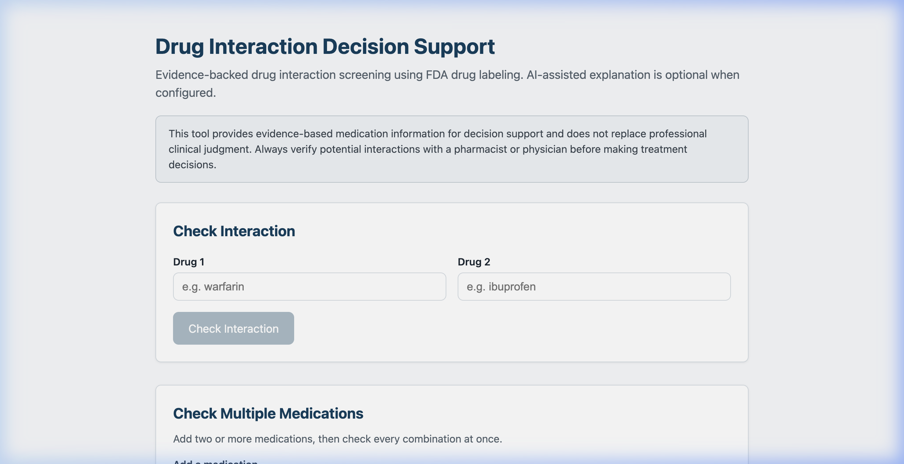
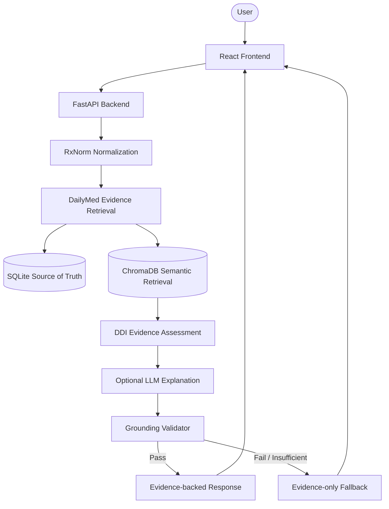
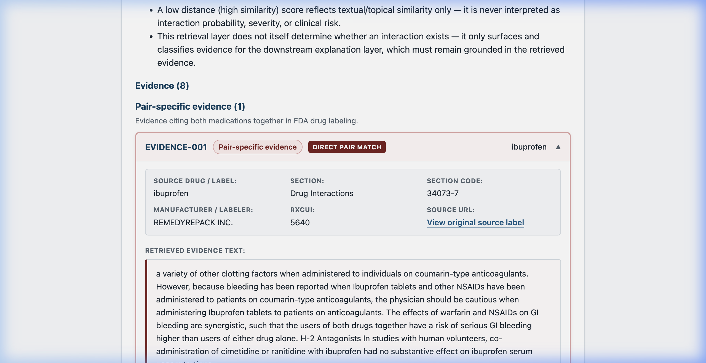

# RAG-Based Drug–Drug Interaction Decision Support System

An evidence-grounded RAG prototype for retrieving drug-label evidence and generating constrained explanations for potential drug–drug interactions.



## Overview

Clinical decision support systems require extreme accuracy. General-purpose Large Language Models (LLMs) are unreliable for drug–drug interactions because they can hallucinate severity, invent interactions, or fail to state the source of their claims.

This system demonstrates a different approach. By integrating **structured API lookups** (RxNorm) with **Retrieval-Augmented Generation** (ChromaDB over DailyMed structured product labels), the system provides interaction checks that are entirely bounded by official documentation.

### Key Design Principle

> **The LLM is the explanation layer — not the source of truth.**

**AI explains the evidence. The evidence sets the boundary.**
- Drug identity is normalized strictly through RxNorm before any explanation happens.
- Pair-specific evidence is mathematically distinguished from generalized supporting evidence.
- A deterministic grounding validator constrains the generated LLM claims against the retrieved evidence IDs.
- Insufficient evidence triggers an automatic fallback rather than a hallucinated interaction claim.

## Architecture



## Features

- **Medication Normalization:** Maps arbitrary user input to RxCUIs using the NIH RxNorm API.
- **Drug-Label Evidence Retrieval:** Fetches official structured product labels from DailyMed.
- **Semantic Retrieval:** Uses `sentence-transformers` and ChromaDB to perform vector search on chunked label text.
- **Pair-Aware Evidence Assessment:** Accurately classifies whether text describes a specific drug pair interacting, or merely general properties of a single drug.
- **Evidence-Backed Explanations:** Formulates a readable explanation of the interaction mechanism strictly based on retrieved context.
- **Grounding Validation:** Strictly enforces that all LLM claims map directly to retrieved evidence chunks.
- **Evidence-Only Fallback:** If the LLM goes offline or fails validation, the system safely falls back to displaying raw evidence.
- **Multi-Drug Checking:** Capable of checking complex multi-drug regimens in a single request.
- **Modular LLM Provider Architecture:** Pluggable support for OpenRouter, xAI (Grok), Gemini, and "none" (evidence-only mode).
- **Modern Stack:** React + Vite interface and a FastAPI Python backend.

## Evidence Flow

1. **RxNorm** → Identify and normalize medication input.
2. **DailyMed** → Retrieve official FDA drug-label evidence.
3. **SQLite** → Local source-of-truth evidence storage.
4. **ChromaDB** → Semantic retrieval of relevant label sections.
5. **DDI Assessment** → Classify evidence status (e.g., pair-specific vs. supporting).
6. **Grounding Validator** → Constrain model output to verified claims.
7. **LLM** → Formulate an explanation of the retrieved evidence.

## Example

Checking for an interaction between **Warfarin** and **Ibuprofen**.

The system retrieves DailyMed label evidence highlighting that NSAIDs (like Ibuprofen) can increase the anticoagulant effect of Warfarin and increase the risk of serious bleeding. The LLM summarizes this mechanism and the frontend presents both the explanation and the underlying *EvidenceCard* containing the exact retrieved excerpt.



## Tech Stack

- **Backend:** Python, FastAPI, Pydantic, SQLAlchemy, pytest
- **Frontend:** React, Vite, vitest
- **Data/Retrieval:** SQLite, ChromaDB, `sentence-transformers`
- **External APIs:** RxNorm, DailyMed
- **LLM Integrations:** OpenRouter, xAI, Google Gemini

## Project Structure

```
drug-interaction-rag/
├── backend/            # FastAPI app, RAG pipeline, services, test suite
├── frontend/           # React + Vite UI, frontend test suite
├── docs/               # Architecture, build logs, API references
├── scripts/            # Setup, ingestion, pipeline test scripts
├── .env.example        # Environment variable template
├── .gitignore
└── README.md
```

## Running Locally

### Backend Setup

```bash
cd backend
python -m venv .venv
source .venv/bin/activate        # Windows: .venv\Scripts\activate
pip install -r requirements.txt -r requirements-dev.txt

# Create your .env file
cp ../.env.example ../.env
```

Open `../.env` and supply your LLM API keys. **Never commit this file.** (Use `LLM_PROVIDER=none` to test locally without an API key).

```bash
# Initialize local SQLite knowledge base
python ../scripts/setup_data.py

# Ingest sample labels
python ../scripts/ingest_labels.py --seed

# Build the vector index
python ../scripts/build_vector_index.py

# Start the backend server
uvicorn app.main:app --reload --port 8001
```

### Frontend Setup

```bash
cd frontend
npm install
npm run dev
```

Navigate to `http://localhost:5173/` in your browser.

## API

The backend exposes the following primary endpoints:

- `GET /api/health` - System health and component status.
- `GET /api/drugs/search?q={query}` - Search and normalize a drug via RxNorm.
- `POST /api/interaction/check` - Check a 2-drug pair for interactions.
- `POST /api/interaction/check-multiple` - Check a multi-drug regimen (up to 10 drugs).

Interactive Swagger documentation is available at `http://localhost:8001/docs` when the backend is running.

## Testing

This project maintains a comprehensive test suite to ensure safety and logic consistency.

- **Backend:** 329 tests passing (`pytest`)
- **Frontend:** 58 tests passing (`npm test`)
- **Linting:** Passing (`npm run lint`)
- **Build:** Production builds successfully (`npm run build`)

## Safety and Limitations

**This is a prototype / academic decision-support system.**
- **Not a medical device.**
- **Not a prescribing system.**
- **Not a substitute for clinical judgment.**
- Evidence coverage in this prototype is limited to the local seed set and DailyMed retrieval logic.
- **Absence of retrieved evidence does not prove the absence of an interaction.**
- Severity is only reported when explicitly supported by the retrieved evidence.
- The LLM is *not* the interaction detection source of truth; it merely explains what the RAG pipeline found.
- Real-world clinical and regulatory validation would be required before any production deployment.

## Future Improvements

- Broader evidence coverage across diverse interaction knowledge sources.
- Improved asynchronous ingestion and update workflows for drug labels.
- Larger-scale validation against known clinical interaction datasets.
- Clinical expert evaluation of explanation accuracy.
- Production security, persistent rate limiting, and observability.
- Deployment hardening.
